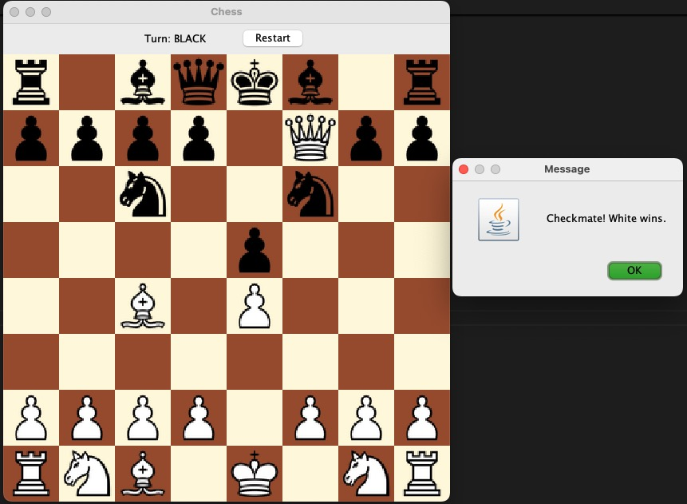

# ♟️ Java Chess Game

A fully functional, object-oriented Chess game built in Java using the Swing GUI framework. Built from scratch to demonstrate understanding of game mechanics, GUI interaction, and object-oriented design.

---

## 🧠 Features

- Click-to-move interface
- Legal move validation for all pieces
- Pawn promotion to queen
- Turn tracking and move enforcement
- Check and checkmate detection
- Game restart functionality
- Image-based chess board using custom PNG pieces

---

## ❌ Not Yet Implemented

These features are planned for a future version:

- Castling
- En Passant
- Stalemate / Draw conditions
- AI opponent

---

## ▶️ How to Run

### ✅ Option 1: Compile and Run (via Terminal)

```bash
javac -d bin src/chess/*.java
java -cp bin chess.main
```

### ✅ Option 2: Use IDE (Eclipse, IntelliJ, VS Code)

- Import the `src/` folder as a Java project
- Make sure the `/resources` folder is marked as a resource directory
- Run `main.java` which launches the game (`new GameFrame()`)

### ✅ Option 3: Run via Executable JAR (if exported)

If you’ve built `ChessGame.jar`, you can run it with:

```bash
java -jar ChessGame.jar
```

---

## 🗂 Directory Structure

```
/ChessGame/
 ├── src/chess/         # Java source files (Board, Pieces, GameFrame, etc.)
 ├── resources/         # Images: .png files for all pieces
 ├── README.md
 ├── .gitignore
```

---

## 📸 Screenshot



---

## 📚 Author

Made by Jared Simpson. For portfolio, learning, and fun.

---
